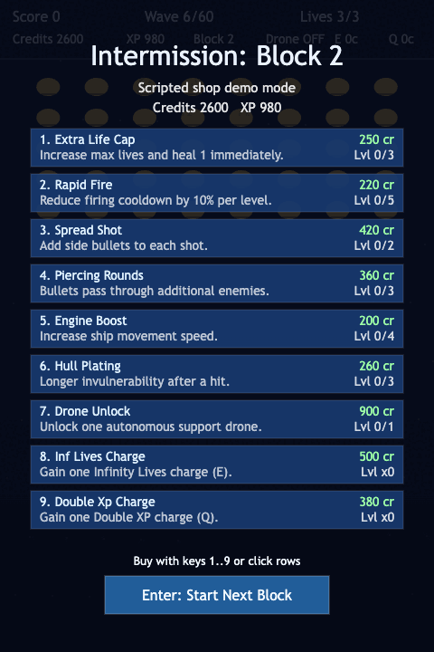

# daily-classic-game-2026-02-23-galaxian-dive-bomb-enemies

  Deterministic Galaxian-inspired arcade shooter with 5-wave shop intermissions, tactical run upgrades, timed power activations, and escalating pressure through wave 60.

  
  
  

## GIF Captures
- `Formation Sweep`: `assets/gifs/formation.gif`
- `Dive Pressure`: `assets/gifs/dive-bomb.gif`
- `Wave Push`: `assets/gifs/wave-clear.gif`
- `Shop Intermission`: `assets/gifs/shop-upgrades.gif`

## Quick Start
1. `pnpm install`
2. `pnpm dev`

## How To Play
1. Press Enter or click to start.
2. Move with Arrow keys (`A`/`D`) and fire with `Space`.
3. Every 5 cleared waves, buy upgrades in intermission using keys `1..9` or row clicks.
4. Continue to the next block with `Enter`.
5. Activate timed powers with `Q` (Double XP) and `E` (Infinity Lives).

## Rules
1. Enemy formations sweep and descend; collisions and enemy bullets cost lives.
2. Dive-bomb enemies break formation and rush the player on deterministic timers.
3. Intermission shop appears after waves `5, 10, ..., 55`.
4. The run ends in `victory` at wave 60 or `gameover` when lives are exhausted.

## Scoring
1. Standard enemy destroys award score, credits, and XP.
2. Diving enemies award higher score and resource values.
3. Wave clears grant block-scaled bonuses.
4. Double XP multiplies XP earnings during its active timer.

## Twist
The game mixes classic Galaxian pressure with run-based strategy: every 5 waves you choose upgrades (spread, pierce, rapid fire, drone support, timed powers), then face harder formations, faster dives, and stronger projectile pressure.

## Verification
1. `pnpm test`
2. `pnpm build`
3. `pnpm preview -- --host localhost --port 4173`
4. `pnpm capture`

## Project Layout
- `index.html`: Canvas shell
- `src/game.ts`: Deterministic simulation, upgrades, difficulty, shop economy
- `src/main.ts`: Input mapping, HUD, intermission overlay, rendering
- `src/game.test.ts`: progression and determinism tests
- `scripts/capture_playwright.mjs`: local wrapper for Playwright capture
- `playwright/main-actions`: gameplay capture artifacts
- `playwright/shop-actions`: intermission shop capture artifacts
- `assets/gifs`: named GIF clips for gameplay and shop flow
