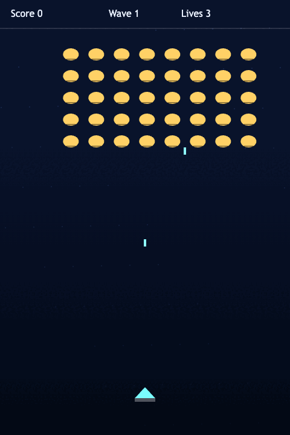
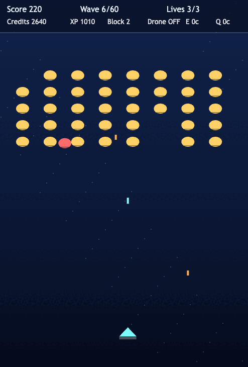
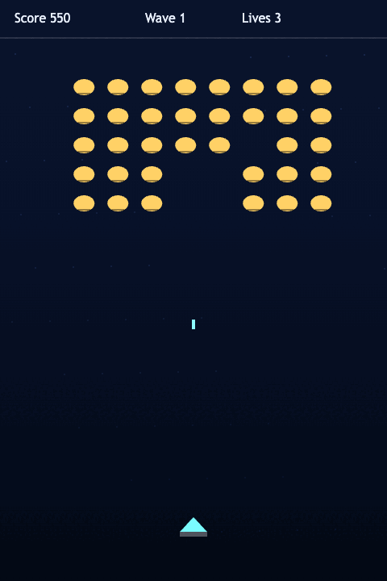

# daily-classic-game-2026-02-23-galaxian-dive-bomb-enemies

  A deterministic fixed shooter inspired by Galaxian, featuring timed dive-bomb attacks and escalating wave speed.

  
  
  

## Quick Start
1. `pnpm install`
2. `pnpm dev`

## How To Play
1. Press Enter or click the canvas to start.
2. Move left/right with Arrow keys (A/D).
3. Shoot with Space.
4. Pause with P, restart with R.

## Rules
1. Enemies march as a formation and step down when they reach the edge.
2. A dive-bomb timer sends a random invader toward the player.
3. Colliding with a diving invader costs a life.
4. If the formation reaches the lower danger zone, the run ends.

## Scoring
1. Standard invader: 100 points.
2. Dive-bomb invader: 150 points.

## Twist
Dive-bomb enemies break formation at deterministic intervals, forcing fast repositioning and rewarding precision shots.

## Verification
1. `pnpm test`
2. `pnpm build`
3. `WEB_GAME_URL="http://127.0.0.1:4173/?scripted_demo=1&seed=20260223" node /Users/testaccountforsystem-wideissues/.codex/skills/develop-web-game/scripts/web_game_playwright_client.js --actions-file playwright_actions.json --screenshot-dir playwright/main-actions --iterations 5 --pause-ms 200`

## Project Layout
- `index.html`: Canvas shell
- `src/main.ts`: Input handling, render loop, and automation hooks
- `src/game.ts`: Deterministic simulation rules
- `src/game.test.ts`: Determinism + restart tests
- `assets/gifs`: Gameplay captures
- `playwright/main-actions`: Automated capture artifacts
